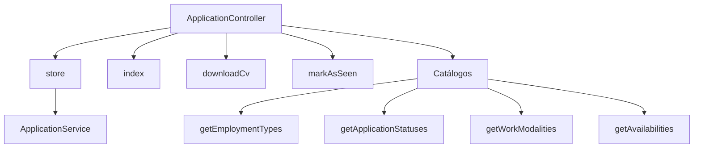

# 📄 Postulaciones App - Backend


API robusta para gestión de postulaciones laborales con almacenamiento y recuperación eficiente de datos.

## 🚀 Tecnologías Principales

- **Laravel 12**
- **PHP 8.2.x**
- **MySQL**
- **Storage** para manejo de archivos
- **API RESTful**

## 🌟 Características Destacadas

### Endpoints Principales
✔ `POST /applications`: Crear postulaciones con CV  
✔ `GET /applications`: Listado paginado  
✔ `GET /applications/{id}/cv`: Descarga de PDF  
✔ `PATCH /applications/{id}/mark-as-seen`: Marcar como vista  
✔ Catálogos: Tipos de empleo, estados y modalidades  

### Funcionalidades
📋 Paginación server-side  
📄 Almacenamiento seguro de archivos  
✅ Validación estricta de datos  
🔒 Respuestas JSON estandarizadas  

## 🛠️ Configuración Local

### Prerrequisitos
- PHP (≥ 8.2)
- Composer
- MySQL
- Servidor local (XAMPP/Laragon/Herd)

### Instalación
```bash
# 1. Clonar repositorio
git clone https://github.com/enriquemdev/postulaciones-api.git
cd postulaciones-app-backend

# 2. Instalar dependencias
composer install

# 3. Configurar entorno
cp .env.example .env
# Editar .env con tus credenciales MySQL

# 4. Generar clave
php artisan key:generate

# 5. Ejecutar migraciones
php artisan migrate

# 6. Iniciar servidor
php artisan serve
```

La API estará disponible en `http://localhost:8000/api`

## ✅ Buenas Prácticas Implementadas

| Área               | Implementación                                                                 |
|--------------------|-------------------------------------------------------------------------------|
| **Código Limpio** | Conventional Commits, estructura MVC clara                                   |
| **Validación**    | Request classes para validación robusta                                      |
| **Modularidad**   | Servicios (ApplicationService) para lógica de negocio                        |
| **Seguridad**     | Storage para archivos, códigos HTTP adecuados                                |
| **Escalabilidad** | Paginación nativa, diseño RESTful                                           |

## 🏗️ Estructura de la API



## 📬 Contacto

¿Preguntas o sugerencias?  
✉️ [enriquemunozdev@gmail.com](mailto:enriquemunozdev@gmail.com)